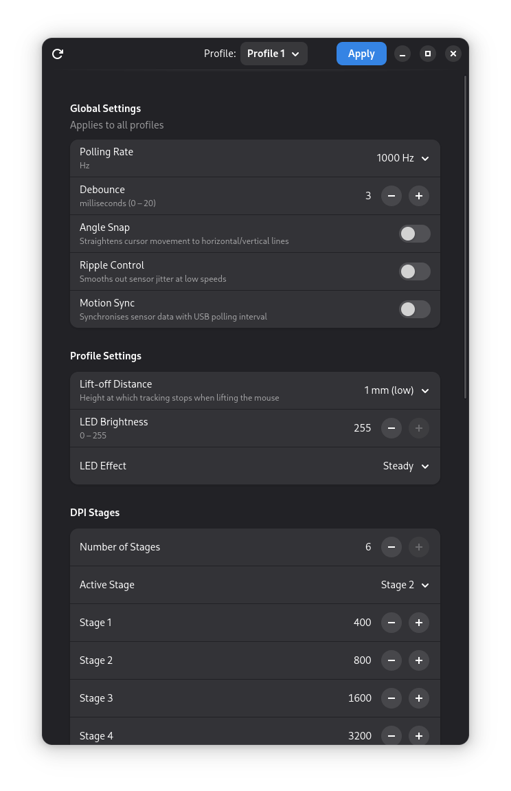
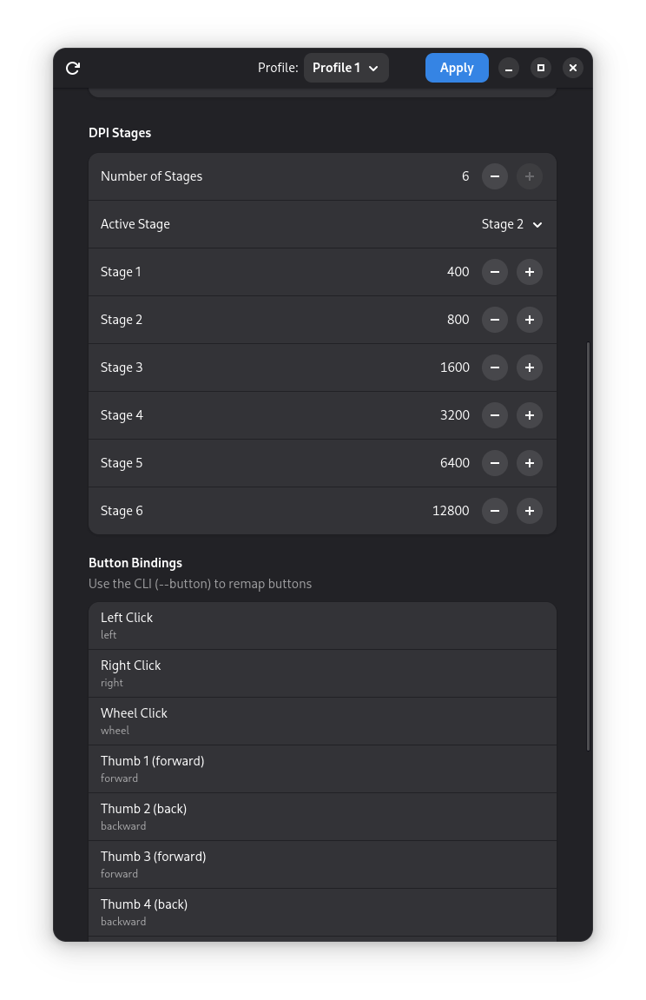
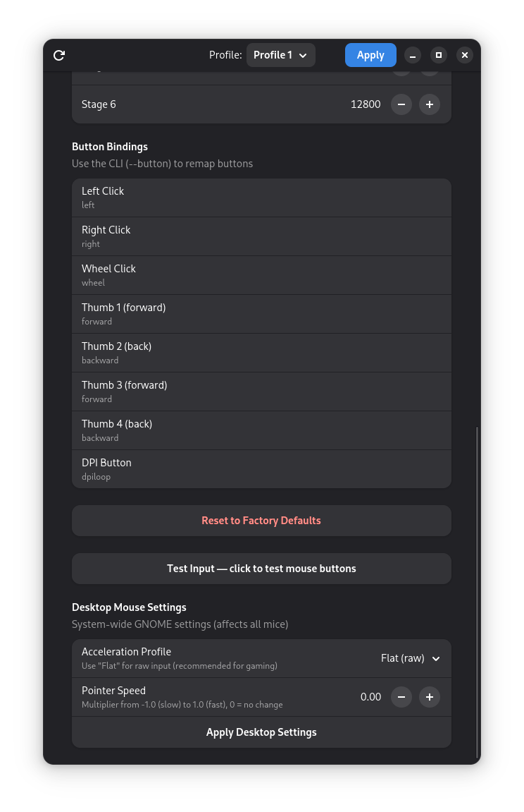
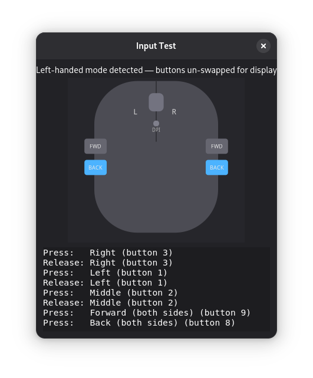
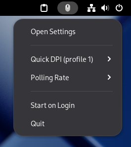

# pulsar-x2a-linux

Linux configuration tool for the **Pulsar X2A Medium Wired** gaming mouse.

Reverse-engineered from USB HID captures of Pulsar Fusion on Windows 11.

## Screenshots

| Global & Profile Settings | DPI Stages & Button Bindings |
|:---:|:---:|
|  |  |

| Desktop Settings & Test | Input Test Dialog | System Tray |
|:---:|:---:|:---:|
|  |  |  |

## Requirements

```
sudo apt install python3-usb python3-gi gir1.2-gtk-4.0 gir1.2-adw-1
```

For the system-tray applet:
```
sudo apt install gir1.2-ayatanaappindicatorglib-2.0
```

On GNOME you also need the AppIndicator shell extension for the tray icon to appear:
```
sudo apt install gnome-shell-extension-appindicator
# then enable it (Ubuntu):
gnome-extensions enable ubuntu-appindicators@ubuntu.com
# or on other distros:
gnome-extensions enable appindicatorsupport@rgcjonas.gmail.com
```
Then restart GNOME Shell (log out/in, or Alt+F2 → r → Enter on X11).

## Installation (optional — run without sudo)

```bash
sudo cp 50-pulsar-x2a.rules /etc/udev/rules.d/
sudo udevadm control --reload-rules && sudo udevadm trigger
sudo usermod -aG plugdev $USER   # re-login after this
```

## GUI + System Tray

```bash
pulsar-x2a-gui    # if installed via .deb
# or: python3 pulsar_x2a_gui.py
```

GTK4 + libadwaita settings window with integrated system tray:
- Reads all settings from the mouse on startup, writes on **Apply**
- System tray via D-Bus StatusNotifierItem (no GTK3 conflict)
- Tray shows DPI/polling rate on change, quick DPI presets, polling rate radio buttons
- **X** hides the window (tray stays alive), **Quit** from tray menu exits
- "Start on Login" toggle in the tray menu for autostart
- Input test dialog with mouse diagram and event log
- Desktop mouse settings (GNOME acceleration profile, pointer speed)

## CLI usage

```
# Show all settings
sudo python3 pulsar_x2a.py

# Show one profile
sudo python3 pulsar_x2a.py --profile 1

# Polling rate (global)
sudo python3 pulsar_x2a.py --poll 1000      # 125 / 250 / 500 / 1000

# Debounce (global, ms)
sudo python3 pulsar_x2a.py --debounce 3

# Switches (global: on/off)
sudo python3 pulsar_x2a.py --angle-snap off
sudo python3 pulsar_x2a.py --ripple off
sudo python3 pulsar_x2a.py --motion-sync off

# DPI stages for profile 1 (up to 6 stages)
sudo python3 pulsar_x2a.py --profile 1 --dpi 400,800,1600,3200
sudo python3 pulsar_x2a.py --profile 1 --dpi 400,800,1600,3200 --active-stage 2

# Lift-off distance (per-profile)
sudo python3 pulsar_x2a.py --profile 1 --lod 1    # 1 mm or 2 mm

# LED brightness and effect (per-profile)
sudo python3 pulsar_x2a.py --profile 1 --brightness 200
sudo python3 pulsar_x2a.py --profile 1 --led steady
sudo python3 pulsar_x2a.py --profile 1 --led breath --breath-speed 50

# Per-stage LED colour (per-profile, RGB 0-255)
sudo python3 pulsar_x2a.py --profile 1 --stage-color 1 255 0 0    # stage 1 = red
```

## OS Tweaks for Gaming

The GUI has a "Desktop Mouse Settings" section for GNOME, but you can also
apply these from the command line or set them at the OS level.

### Disable mouse acceleration (recommended for FPS gaming)

```bash
# GNOME / Wayland / X11
gsettings set org.gnome.desktop.peripherals.mouse accel-profile 'flat'

# Reset pointer speed to neutral (0 = no modification)
gsettings set org.gnome.desktop.peripherals.mouse speed 0
```

### Kernel boot options (advanced)

For lowest possible input latency, add to `/etc/default/grub` in
`GRUB_CMDLINE_LINUX_DEFAULT`:

```
usbhid.mousepoll=1    # 1ms USB polling (default is 10ms for non-gaming mice)
```

Then run `sudo update-grub && reboot`.

> **Note:** The mouse already reports `bInterval=1` so the kernel should
> honour 1ms polling by default with most USB controllers. This option is
> only needed if you suspect the kernel is overriding the interval.

## Protocol notes

| Setting | Scope | cat | reg (write/read) | sub |
|---|---|---|---|---|
| Polling rate | global | 0x01 | 0x09 / 0x89 | 0x02 |
| Debounce | global | 0x04 | 0x03 / 0x83 | 0x03 |
| Angle snap | global | 0x07 | 0x04 / 0x84 | 0x02 |
| Ripple control | global | 0x07 | 0x03 / 0x83 | 0x02 |
| Motion sync | global | 0x07 | 0x05 / 0x85 | 0x02 |
| LOD | per-profile | 0x07 | 0x02 / 0x82 | 0x03 |
| DPI stages (bulk) | per-profile | 0x05 | 0x04 / 0x84 | 0x21 / 0x15 |
| DPI active stage | per-profile | 0x05 | 0x01 / 0x81 | 0x02 |
| Stage LED colour | per-profile | 0x05 | 0x05 / 0x85 | 0x05 |
| Brightness | per-profile | 0x03 | 0x03 / 0x83 | 0x03 |
| LED effect | per-profile | 0x03 | 0x04 / 0x84 | 0x0F |

Packet: 64 bytes, Interface 3, HID Feature report (wValue=0x0300).
Checksum: bytes[62:64] = LE uint16(sum(bytes[0:62])).

## Related Projects

- [python-pulsar-mouse-tool](https://github.com/andrewrabert/python-pulsar-mouse-tool) — Linux tool for the Pulsar X2 V2 Mini (wireless, battery support)
